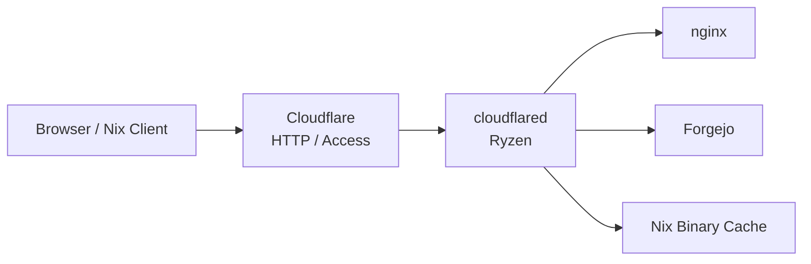
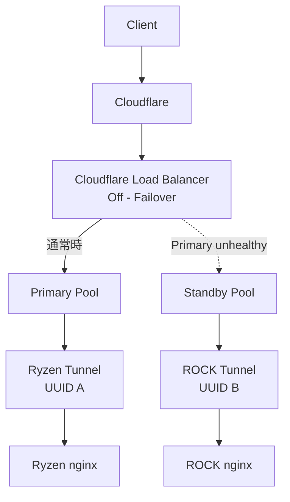
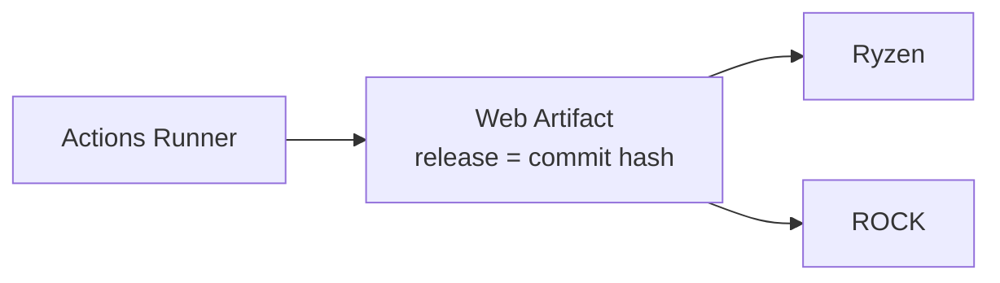
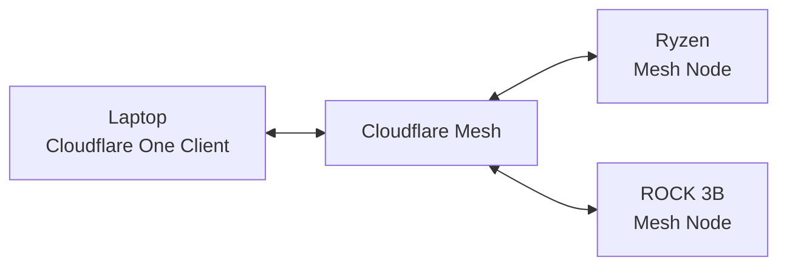
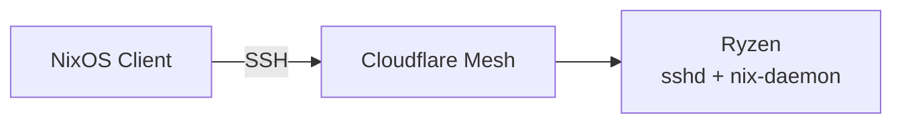
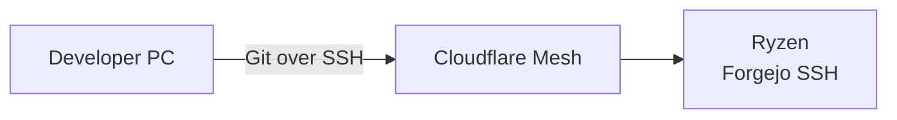
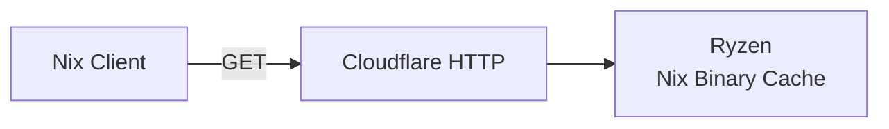
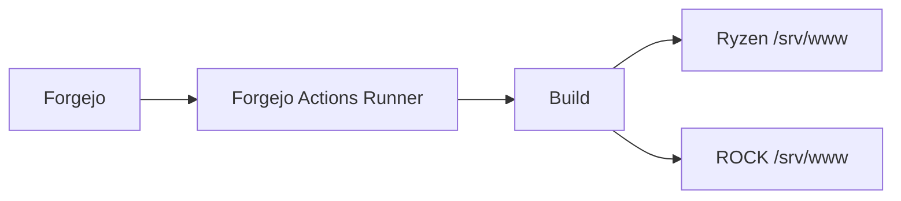
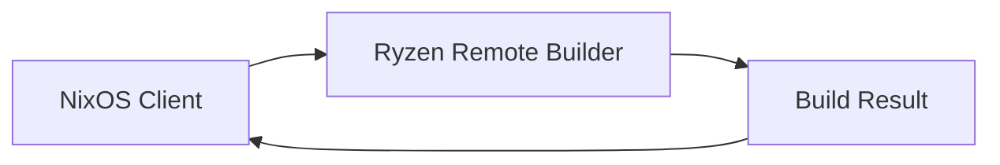
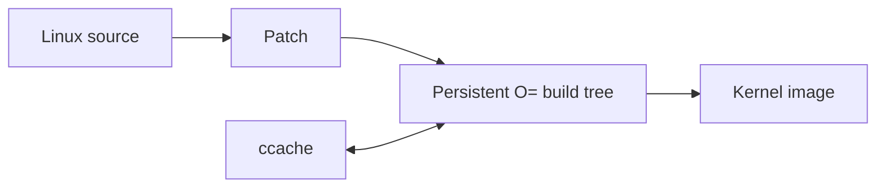

# 自宅サーバー構成 要件定義・実装ロードマップ

## 1. 目的

本プロジェクトは、Ryzen搭載PCを主系サーバー、Radxa ROCK 3Bを非常用待機サーバーとして構成し、以下のサービスを安定して提供することを目的とする。

1. Webサーバー
2. Forgejo
3. Forgejo Actions Runner
4. Nix Remote Build Environment
5. Nix Binary Cache

平常時はRyzen機のみで完結させ、ROCK 3Bを常時通信経路へ介在させない。(ROCK 3Bは平常時の停止確率が高いため)

ROCK 3BはUPS配下で常時稼働し、Ryzen機の停止時にWeb公開のみを継続する非常用待機系として利用する。

また、Ryzen機はNixのリモートビルドだけでなく、Linuxカーネルへのパッチ適用・検証時の高速ビルド環境としても利用する。

---

## 2. 基本方針

### 2.1 構成ファイルについて

現在のlaptop及びROCK 3Bのconfigurationファイルは`~/nixos-config`内に存在する。

今後の方針としては、`~/nixos-config`はクライアントのNixOS用、当ディレクトリ`~/servers-config`はサーバーのNixOS用に利用するものとし、最終的にはROCK 3Bのファイルも再構成と同時に`~/servers-config`へ移動する。

また`~/servers-config`についても`~/nixos-config`と同じようなファイルパターンで構成する。

### 2.2 主系と待機系

- Ryzen機を唯一の主系サーバーとする。
- ROCK 3Bは非常用Webサーバーとして待機させる。
- 平常時のWeb、Git、CI、Nix関連処理はすべてRyzen機で行う。
- ROCK 3Bは平常時のリクエスト経路には入れない。
- 障害時のみWebトラフィックをROCK 3Bへ切り替える。

### 2.3 保存するデータの正

以下を正とする。

- Gitリポジトリ: Ryzen上のForgejo
- Gitバックアップ: Forgejoのミラー機能によるGitHub
- Webソース: Forgejo
- Web公開成果物: Forgejo Actions Runnerによって生成されたCI成果物
- Nix build result: Ryzen上のNix StoreおよびBinary Cache

ROCK 3BにはGitリポジトリのバックアップを保持しない。

### 2.4 障害モデル

以下の障害状態を想定する。

#### 通常状態

- Ryzen: 稼働
- ROCK 3B: 稼働
- ルーター/ONU: 稼働

すべてのサービスをRyzenが提供する。

#### Ryzenのみ停止

例:

- 停電によりRyzen停止
- RyzenのOS障害
- Ryzenのカーネルパニック
- Ryzenのネットワーク障害
- nginx / cloudflared障害

この場合:

- WebのみROCK 3Bへフェイルオーバーする。
- Forgejoは利用不能とする。
- Actions Runnerは利用不能とする。
- Nix Remote Builderは利用不能とする。
- Nixクライアントはローカルビルドへフォールバックする。
- Nix Binary Cacheは利用不能でも許容する。

#### ROCK 3Bのみ停止

通常時のサービス提供には影響を与えない。

#### RyzenとROCK 3Bの両方が停止

ルーター故障、ONU故障、UPS系統障害、Cloudflareの障害などを含む。

この状態は非常に稀かつ家庭内設備のみでは対処不能な障害として扱い、追加の冗長化対策は行わない。

---

## 3. ハードウェア構成

## 3.1 Ryzenサーバー

想定構成:

- CPU: AMD Ryzen 7 3700X
- RAM: 16GB (年内までに32GBへアップグレード予定)
- NVMe SSD: 500GB × 2, Btrfs RAID 1
- OS: NixOS
- ネットワーク: 有線Ethernet

主用途:

- Webサーバー
- Forgejo
- Forgejo Actions Runner
- Nix Remote Builder
- Nix Binary Cache
- Linux kernel build
- CI/CD

### ストレージ

500GB NVMe SSD 2枚をミラー構成で使用する。

基本案:

- Btrfs RAID1
- usable capacity: 約500GB
- `compress=zstd`
- 定期scrub
- SMART監視
- 定期的なclean up

想定領域:

```text
/
├── /nix
├── /srv/forgejo
├── /srv/www
├── /srv/kernel
└── /srv/nix-cache
```

kernel build treeやccacheなど、高頻度で書き換える領域については、必要に応じてBtrfs CoW無効化を検討する。

---

## 3.2 ROCK 3B

ROCK 3Bは非常用待機サーバーとして再構築する。

搭載する主なサービス:

- NixOS
- nginx
- cloudflared
- OpenSSH
- Web公開成果物

原則として搭載しないもの:

- Forgejo
- Forgejo Actions Runner
- Nix Binary Cache
- 重いコンテナ環境
- デスクトップ環境
- Gitバックアップ

ROCK 3B、ルーター、ONUはUPS経由で給電される。

---

## 4. ネットワーク・公開構成

外部との通信はCloudflareを経由することを基本とする。ただし、HTTP公開サービスと管理・ビルド用途の通信では性質が異なるため、以下の2系統に分離する。

* **公開系**: Cloudflare Tunnel / Access
* **管理・ビルド系**: Cloudflare Mesh / Cloudflare One Client

ROCK 3Bを平常時の通信経路やゲートウェイとして使用せず、RyzenとROCK 3Bはそれぞれ独立してCloudflareへ接続する。

### 4.1 公開HTTPサービス

以下のサービスはCloudflare Tunnelを介して公開する。

* Webサーバー
* Forgejo Web UI
* Nix Binary Cache



平常時はRyzen側のTunnelのみを主系として使用する。

ROCK 3Bは非常用Webサーバー専用のTunnelを持ち、通常時の通信経路には介在させない。

### 4.2 Webフェイルオーバー

Webサーバーの冗長化には、Cloudflare Load BalancingによるActive-Passive Failoverを使用する。

RyzenとROCK 3Bにはそれぞれ独立したCloudflare Tunnelを構築し、同一Tunnelのreplicaとしては構成しない。



#### Tunnel構成

以下の2本のTunnelを独立して作成する。

```text
web-ryzen
└── Ryzen nginx

web-rock
└── ROCK 3B nginx
```

それぞれ異なるTunnel UUIDを持たせる。

同一Tunnel UUIDをRyzenとROCKで共有する構成は採用しない。

これは、同一TunnelのreplicaではCloudflare Load Balancerから個別のoriginとして識別できず、RyzenとROCK間で明示的な優先順位を設定できないためである。

#### Load Balancer構成

Web公開hostnameにCloudflare Public Load Balancerを設定する。

Load Balancerには以下の2つのpoolを設定する。

| Pool          | Endpoint          | 役割                 |
| ------------- | ----------------- | ------------------ |
| `web-primary` | Ryzen Tunnel UUID | Primary            |
| `web-standby` | ROCK Tunnel UUID  | Standby / Fallback |

Tunnel endpointには以下の形式を使用する。

```text
<RYZEN_TUNNEL_UUID>.cfargotunnel.com
<ROCK_TUNNEL_UUID>.cfargotunnel.com
```

各endpointにはWeb公開hostnameをHost headerとして設定する。

Traffic Steeringは `Off - Failover` とし、poolの優先順位を以下とする。

```text
1. web-primary
2. web-standby
```

Fallback Poolには`web-standby`を指定する。

これにより通常時はRyzenのみへトラフィックを送り、Ryzen側poolがunhealthyと判定された場合のみROCK 3Bへ切り替える。

Ryzen側が再びhealthyになった場合は、自動的にRyzenへfailbackする。

---

#### Health Check

障害判定にはCloudflare Load BalancerのHTTPS Monitorを使用する。

単に`cloudflared`プロセスがCloudflareへ接続できることだけではなく、nginxまで正常に応答できることを確認する。

両サーバーのnginxに以下のhealth check endpointを用意する。

```text
/healthz
```

正常時には以下を返す。

```text
HTTP 200
Body: ok
```

Health Monitorは概ね以下の条件とする。

```text
Protocol: HTTPS
Method: GET
Path: /healthz
Expected Status: 200
Expected Body: ok
Host Header: Web公開hostname
```

Cloudflare Load BalancingのMonitorはHTTP status codeだけでなくresponse bodyも検証可能なため、単純なTCP接続確認よりもアプリケーションに近いレベルで正常性を判断する。

必要に応じてMonitor専用HTTP headerを追加する。

例:

```text
X-Health-Check: <secret>
```

nginx側では、このheaderを持つHealth Monitorからのリクエストにのみ`/healthz`を応答させる構成としてもよい。

Webサイト自体をCloudflare Accessで保護する場合は、Health MonitorがAccess認証によって遮断されないよう、`/healthz`のみ別途Monitor用の経路を設ける。

---

#### 障害判定

以下のいずれかにより`/healthz`への正常な応答が失われた場合、Ryzen側をunhealthyと判断する。

```text
Ryzen電源断
Ryzen OS停止 / kernel panic
ネットワーク断
cloudflared停止
nginx停止
nginx設定異常
Web公開経路の異常
```

これにより、単にTunnel connectionが存在するだけでWebサービスをhealthyとはみなさない。

Health Monitorのinterval、timeout、retry、`consecutive_down`、`consecutive_up`は誤検知と切替時間のバランスを考慮して設定する。

初期設定では、単発のpacket loss等でfailoverしないよう、複数回連続で失敗した場合にunhealthyとする。

```text
Healthy
  ↓
Health Check Failure
  ↓
再試行 / 連続失敗確認
  ↓
Primary Unhealthy
  ↓
ROCKへFailover
```

復旧時も同様に複数回の正常応答を確認してからRyzenをhealthyへ戻し、短時間の状態変化による頻繁な切り替えを防止する。

---

#### フェイルオーバー時の動作

通常時:

```text
Client
  ↓
Cloudflare
  ↓
web-primary
  ↓
Ryzen Tunnel
  ↓
Ryzen nginx
```

Ryzen障害時:

```text
Client
  ↓
Cloudflare
  ↓
web-standby
  ↓
ROCK Tunnel
  ↓
ROCK nginx
```

Ryzen復旧時:

```text
Ryzen /healthz recovery
  ↓
Cloudflare Monitor detects healthy
  ↓
web-primary healthy
  ↓
automatic failback
  ↓
Ryzen nginx
```

ROCK 3Bは平常時の通信経路には介在しない。

---

#### Webコンテンツの整合性

ROCK側には、Forgejo Actions RunnerによってRyzenと同時にデプロイされた最後の正常releaseを保持する。



フェイルオーバー機構はWebコンテンツの同期を行わない。

コンテンツ同期はCI/CDの責務とし、Cloudflare Load Balancerは既にデプロイ済みのorigin間で通信先を切り替えることだけを担当する。

---

#### 両系統障害時

RyzenとROCKの両方がunhealthyになった場合、正常なWeb提供は保証しない。

Cloudflare Load Balancerではすべてのpoolがunhealthyの場合でもFallback Poolが最終的な転送先となるため、`web-standby`をFallback Poolとして設定する。

ただしROCK自身も停止している場合、Webアクセス不能となることを許容する。

これは以下のような状況を想定する。

```text
UPS停止
ルーター故障
ONU故障
回線障害
RyzenとROCKの同時故障
```

これらは本システムの冗長化対象外とする。

---

#### 障害試験

構築後、以下の障害を意図的に発生させてfailoverを確認する。

```text
1. Ryzen nginx停止
2. Ryzen cloudflared停止
3. Ryzen Ethernet切断
4. Ryzen shutdown
5. Ryzen再起動・復旧
```

各試験について以下を確認する。

```text
Primaryがunhealthyになる
        ↓
ROCKへ切り替わる
        ↓
Webが閲覧可能
        ↓
Ryzen復旧
        ↓
Primaryがhealthyになる
        ↓
Ryzenへ自動failback
```

また、ROCK停止中でもRyzenの通常運用に一切影響しないことを確認する。

---

#### 実装上の前提

Cloudflare Load BalancingはCloudflare Tunnelとは別のadd-on機能として使用する。

2026年9月時点でCloudflareのBasic Load Balancingは月額課金のadd-onとして提供されている。

この追加費用は、ROCKを常時proxyとして経由させずに、Cloudflare側でhealth check、failover、failbackを完結させるための運用コストとして許容する。


### 4.3 管理・ビルドネットワーク

SSH、Nix Remote Build、ホスト間管理通信などはCloudflareのHTTPプロキシを使用せず、Cloudflare Meshを使用する。

各管理対象ホストを独立したMesh nodeとして接続する。



主な用途:

* RyzenへのSSH
* ROCK 3BへのSSH
* Nix Remote Build
* 管理用ファイル転送
* ホスト間の管理通信

これにより、Cloudflare HTTP proxyのリクエストサイズ制限や、`cloudflared access ssh`によるWebSocket接続への依存を避ける。

Nix Remote BuildはMesh上の通常のSSH接続として構成する。



Ryzenが利用不能な場合、NixクライアントはROCK 3Bへ切り替えず、ローカルビルドへフォールバックする。

### 4.4 Git通信

ForgejoのWeb UIはCloudflare Tunnel経由で公開する。

Git操作については、大容量push時にCloudflareのHTTP request size制限の影響を受ける可能性があるため、SSHを基本とする。



GitHubへのバックアップミラーはForgejoから直接実行する。

Git LFS等の大容量HTTPアップロードについては、必要になった時点で別途転送経路を検討する。

### 4.5 Nix Binary Cache

Binary Cacheの読み出しはCloudflare Tunnel経由のHTTPで提供する。



Binary Cacheへの書き込みは原則としてRyzen上のCIまたはローカルネットワーク内部から行い、Cloudflare HTTP経由で外部からuploadしない。

これにより、Cloudflare HTTP request bodyのサイズ制限の影響を避ける。

### 4.6 通信経路の役割分担

| 通信                 | 経路                         |
| ------------------ | -------------------------- |
| Web閲覧              | Cloudflare Tunnel          |
| Forgejo Web UI     | Cloudflare Tunnel / Access |
| Nix Binary Cache取得 | Cloudflare Tunnel          |
| Git push / pull    | Cloudflare Mesh + SSH      |
| Ryzen管理SSH         | Cloudflare Mesh            |
| ROCK管理SSH          | Cloudflare Mesh            |
| Nix Remote Build   | Cloudflare Mesh + SSH      |
| Web failover       | Cloudflare側でRyzen → ROCK切替 |

この構成により、公開サービスと管理ネットワークを分離しつつ、RyzenとROCK 3Bの間に不要な依存関係を作らない。

平常時はRyzenのみで主要サービスが完結し、ROCK 3Bの障害は通常運用へ影響しない構成とする。

---

## 5. Webサーバー要件

### 5.1 平常時

Ryzen上のnginxからWebコンテンツを配信する。

### 5.2 非常時

Ryzenが利用不能になった場合、Cloudflare側でROCK 3Bへ切り替える。

ROCK 3Bは最後に正常デプロイされたWeb成果物を保持する。

### 5.3 デプロイ方式

WebはForgejo Actions Runner上で一度だけビルドする。

同一成果物を以下へデプロイする。

- Ryzen
- ROCK 3B



RyzenとROCKで別々にbuildしない。

ROCK停止中にROCKへのデプロイが失敗しても、その失敗は許容し、Ryzenへのデプロイと後続処理は継続する。
ROCK復帰後も、明示的な命令がない限り自動同期は行わず、最後に正常デプロイされたWeb成果物を保持する。

### 5.4 リリース管理

`~/nixos-config`に存在するROCK 3B向け構成にすでに運用しているものがあるため、原則それに従う。(モジュールをそのまま持ってくる形が望ましい)

---

## 6. Forgejo要件

ForgejoはRyzen上のみで稼働させる。

役割:

- Gitホスティング
- Actions起点
- Webソース管理
- Nix configuration管理

GitリポジトリはForgejoのミラー機能を使用してGitHubへバックアップする。

ROCK 3BへのGitバックアップは行わない。

Ryzen障害時にForgejoを利用できないことは許容する。

ForgejoのDBや設定など、GitHub mirrorでは保護されないデータについては別途バックアップ手段を用意するかもしれない(現時点では未定)。

---

## 7. Forgejo Actions Runner要件

RunnerもRyzen上で稼働する。

主な用途:

- Web build
- Web deploy
- Nix build
- NixOS configuration build
- Binary Cacheへの成果物登録

Web buildは一度だけ行い、同一artifactをRyzenとROCKの双方へ配布する。

Runner停止時も既存のWeb配信は継続可能であること。

---

## 8. Nix Remote Build Environment

Ryzenをx86_64-linux用のNix Remote Builderとして利用する。

クライアント例:

- メインノートPC
- その他NixOS x86_64マシン

構成:



Ryzenが利用不能な場合:

- クライアントはローカルビルドへフォールバックする。
- ROCK 3Bをx86_64 buildの代替として使用しない。

Ryzen側では以下を有効化する。

- distributed build
- SSH経由builder
- `big-parallel`
- 必要に応じて `kvm`
- `builders-use-substitutes`

---

## 9. Nix Binary Cache

Binary CacheはRyzen上で提供する。

目的:

- CIで事前buildした成果物の再利用
- ノートPC等のbuild時間短縮
- 複数NixOSホストでのclosure共有

Binary Cacheが停止してもNixクライアントは通常のビルドへフォールバック可能とする。

### 容量管理

Nix StoreのGCとBinary Cacheのretentionは別に管理する。

例:

- Nix Store:
  - 30日以上古い不要generationを定期GC
- Binary Cache:
  - 現在利用中のconfiguration
  - 最近の数世代
  - build costが高い成果物

を中心に保持する。

古いnixpkgs revisionの成果物を無制限に残さない。

---

## 10. Linuxカーネル高速ビルド環境

Ryzenはカーネル開発用ビルドマシンとして利用する。

目的:

- カーネルパッチの開発
- 短時間での再コンパイル
- NixOS用カーネルパッチ検証

ディレクトリ例:

```text
/srv/kernel/
├── linux/
├── build/
├── build-test/
└── ccache/
```

通常のパッチ開発ではNix derivationを毎回使用しない。

開発ループ:



基本方針:

- `make O=/srv/kernel/build`
- `-j16`
- ccache利用
- build directoryを永続化
- 差分コンパイルを最大限利用

パッチ完成後のみNix側へ取り込み、再現可能な正式buildを行う。


---

## 11. NixOS構成管理

RyzenとROCKは同一flake内で管理する。

想定構成:

```text
nixos/
├── flake.nix
├── hosts/
│   ├── ryzen/
│   │   ├── default.nix
│   │   └── hardware.nix
│   └── rock3b/
│       ├── default.nix
│       └── hardware.nix
├── modules/
│   ├── common/
│   ├── cloudflare.nix
│   ├── nginx.nix
│   ├── forgejo.nix
│   ├── runner.nix
│   ├── nix-builder.nix
│   └── monitoring.nix
└── secrets/
```

共通設定はmodule化し、ホスト固有設定を最小化する。

Ryzen:

```text
common
cloudflare
nginx
forgejo
runner
nix-builder
monitoring
```

ROCK:

```text
common
cloudflare
nginx
monitoring
```

---

## 12. 監視・保守

Ryzen側:

- SMART監視
- Btrfs scrub
- Nix GC
- Binary Cache retention
- ディスク使用量監視
- nginx health check
- cloudflared状態監視

ROCK側:

- nginx health check
- cloudflared状態監視
- Web release確認
- UPS環境での再起動試験

---

# 13. 実装ロードマップ

## Phase 0: ハードウェア準備

Ryzen機を組み立てる。

作業:

- NVMe 500GB ×2搭載
- RAM搭載
- Ethernet接続
- BIOS設定確認
- NixOS installer起動確認

完了条件:

- 両NVMeを正常認識する。
- Memtest等でRAM異常がない。
- Ethernetが安定している。

---

## Phase 1: Ryzen基盤構築

NixOSを導入する。

作業:

- Btrfs RAID1構築
- NixOSインストール
- SSH設定
- Cloudflare Tunnel設定
- SMART監視
- Btrfs scrub
- Nix GC

完了条件:

- reboot後も正常起動する。
- 外部からCloudflare経由SSH可能。
- RAID degraded状態を検出可能。
- NixOS configurationがGit管理されている。

---

## Phase 2: Nix Remote Builder

RyzenをRemote Builder化する。

作業:

- build専用ユーザー作成
- SSH key設定
- `nix.buildMachines`
- distributed builds
- builders-use-substitutes

テスト:

- 小規模package
- 大規模package
- NixOS configuration

完了条件:

- クライアントの`nix build`がRyzenで実行される。
- Ryzen停止時にローカルビルド可能。

---

## Phase 3: Kernel Build Environment

カーネル高速ビルド環境を構築する。

作業:

- Linux source配置
- `O=` build directory
- ccache
- build script
- 必要なtoolchain

テスト:

1. full build
2. 1ファイル修正
3. incremental build
4. パッチ適用
5. kernel生成

完了条件:

- 差分コンパイルが機能する。
- Nix buildを介さず高速な開発ループが成立する。

---

## Phase 4: Forgejo移行

既存ForgejoをRyzenへ移行する。

作業:

- Forgejoインストール
- repository移行
- DB移行
- SSH/HTTP確認
- GitHub mirror設定

完了条件:

- clone/push/pull成功
- GitHub mirror成功
- ROCK停止状態でもForgejo利用可能

---

## Phase 5: Actions Runner

RyzenにForgejo Actions Runnerを配置する。

作業:

- Runner登録
- build環境構築
- CI workflow作成

初期CI:

```text
push
↓
Forgejo
↓
Runner
↓
build
```

完了条件:

- Web build成功
- Nix build成功
- CI失敗時に本番環境へ影響しない

---

## Phase 6: Ryzen Web Deployment

RyzenへのWeb自動デプロイを構築する。

作業:

- nginx
- releases構成
- atomic symlink deployment
- `/healthz`

完了条件:

- Git pushから本番反映まで自動化
- build失敗時は既存release維持
- deploy途中状態が公開されない

---

## Phase 7: Nix Binary Cache

Binary Cacheを導入する。

作業:

- Cache server導入
- signing key
- クライアント設定
- CI連携
- retention設定

完了条件:

- CI成果物を他端末が取得可能
- Cache停止時も通常build可能

---

## Phase 8: ROCK 3B再構築

既存ROCK環境を廃止し、待機系として再構築する。

作業:

- 最小NixOS
- nginx
- cloudflared
- OpenSSH
- Web release領域

削除:

- Forgejo
- Runner
- 不要コンテナ
- 不要GUI
- Git backup

完了条件:

- ROCK単体でWeb配信可能
- UPS環境で安定して再起動可能

---

## Phase 9: Dual Deployment

RunnerからRyzenとROCKへ同じWeb成果物を配布する。

作業:

```text
build
├── deploy Ryzen
└── deploy ROCK
```

完了条件:

- 両ホストへのdeploy成功時はrelease ID一致
- ROCK側で独立してWeb配信可能
- 一方へのdeploy失敗を検出可能
- ROCK停止中のdeploy失敗は許容し、Ryzenへのdeployと後続処理を継続する
- ROCK復帰後も、明示的な命令がない限り自動同期しない

---

## Phase 10: Web Failover

Cloudflare側で自動切替を実装する。

監視対象:

- nginx
- cloudflared
- Ryzen host

障害試験:

1. `systemctl stop nginx`
2. `systemctl stop cloudflared`
3. Ryzen shutdown
4. Ethernet切断

それぞれについて:

```text
Ryzen
↓ failure
ROCK
↓ Ryzen recovery
Ryzen
```

が成立することを確認する。

完了条件:

- Ryzen停止時にWeb公開継続
- ROCKは通常時の通信経路に入らない
- Ryzen復旧後に主系へ戻せる

---

# 14. 最終受入条件

以下をすべて満たした時点で構築完了とする。

## 平常運用

- WebがRyzenから配信される。
- Forgejoが利用できる。
- Actions Runnerが利用できる。
- Remote Buildが利用できる。
- Binary Cacheが利用できる。
- ROCKを停止しても平常サービスに影響しない。

## Ryzen障害時

- WebがROCKから配信される。
- Forgejo停止は許容。
- Runner停止は許容。
- Remote Build停止は許容。
- Nix clientがlocal build可能。
- Binary Cache停止は許容。

## データ保全

- Git repositoryがGitHubへmirrorされる。
- 両ホストへのデプロイ成功時は、Webの同一releaseが存在する。ROCK停止中のデプロイ失敗によるreleaseの不一致は許容し、復帰後も明示的な命令がない限り自動同期しない。
- NVMe 1台故障時もRyzenを継続運用可能。

## 保守性

- RyzenとROCKを同一flakeで管理できる。
- Host固有設定と共通moduleが分離されている。
- Nix StoreとBinary Cacheを定期的に整理できる。
- Kernel buildを差分コンパイル可能。

---

# 15. 実装優先順位

優先順位は以下とする。

```text
Ryzen基盤
  ↓
Nix Remote Builder
  ↓
Kernel Build Environment
  ↓
Forgejo
  ↓
Actions Runner
  ↓
Ryzen Web Deployment
  ↓
Nix Binary Cache
  ↓
ROCK再構築
  ↓
Dual Deployment
  ↓
Web Failover
```

最初の実用到達点は、

> ノートPCからRyzenへNix Remote Buildできる状態

とする。

次の到達点は、

> ForgejoへのpushからRyzenへのWeb deployが自動実行される状態

最終到達点は、

> Ryzenを完全停止してもROCK 3BからWebだけは継続公開される状態

とする。
